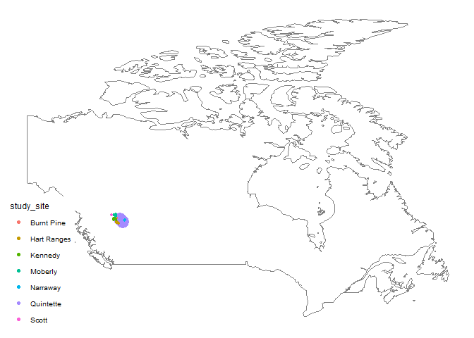
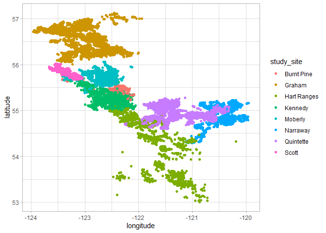
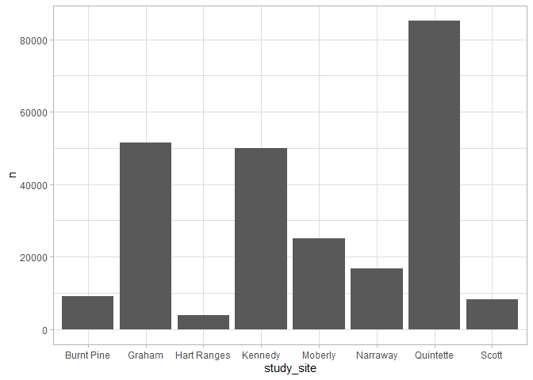
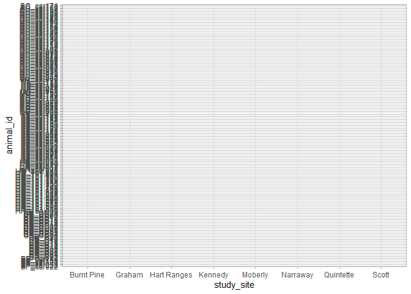

tidycaribou
================
Jon Powell
23/06/2020

``` r
library(tidytuesdayR)
library(tidyverse)
```

    ## -- Attaching packages --------------------- tidyverse 1.3.0 --

    ## v ggplot2 3.3.1     v purrr   0.3.4
    ## v tibble  3.0.1     v dplyr   1.0.0
    ## v tidyr   1.1.0     v stringr 1.4.0
    ## v readr   1.3.1     v forcats 0.5.0

    ## -- Conflicts ------------------------ tidyverse_conflicts() --
    ## x dplyr::filter() masks stats::filter()
    ## x dplyr::lag()    masks stats::lag()

``` r
theme_set(theme_light())
tuesdata <- tidytuesdayR::tt_load('2020-06-23')
```

    ## --- Compiling #TidyTuesday Information for 2020-06-23 ----

    ## --- There are 2 files available ---

    ## --- Starting Download ---

    ## 
    ##  Downloading file 1 of 2: `locations.csv`
    ##  Downloading file 2 of 2: `individuals.csv`

    ## --- Download complete ---

``` r
tuesdata$locations %>% 
view()
locations <- tuesdata$locations

individuals <- tuesdata$individuals %>%
  view()
```

``` r
individuals %>% 
  summarise(across(sex:study_site, list (~ mean(!is.na(.)))))
```

    ## # A tibble: 1 x 6
    ##   sex_1 life_stage_1 pregnant_1 with_calf_1 death_cause_1 study_site_1
    ##   <dbl>        <dbl>      <dbl>       <dbl>         <dbl>        <dbl>
    ## 1     1        0.234     0.0664       0.294         0.189            1

``` r
individuals %>% 
  filter(deploy_on_latitude > 40) %>% 
  filter(deploy_off_type == "dead") %>% 
  #count(death_cause, sort = TRUE) %>% 
  count(study_site, deploy_on_longitude, deploy_on_latitude, sort = TRUE) %>% 
ggplot(aes(deploy_on_longitude, deploy_on_latitude, size = n, colour = study_site))+
  borders("world", regions = "canada" )+
  geom_point() +
  scale_size_continuous(guide = FALSE)+
  ggthemes::theme_map()
```

<!-- -->

``` r
locations %>% 
  ggplot(aes(longitude, latitude, colour = study_site))+
  geom_point()
```

<!-- -->

``` r
locations %>% 
  group_by(animal_id, study_site) %>% 
  summarise(start = min(timestamp),
            end = max(timestamp),
            num_points =n())
```

    ## `summarise()` regrouping output by 'animal_id' (override with `.groups` argument)

    ## # A tibble: 260 x 5
    ## # Groups:   animal_id [260]
    ##    animal_id study_site start               end                 num_points
    ##    <chr>     <chr>      <dttm>              <dttm>                   <int>
    ##  1 BP_car022 Burnt Pine 2003-03-27 20:00:00 2008-03-22 20:44:00        102
    ##  2 BP_car023 Burnt Pine 2003-03-27 20:00:00 2003-08-25 17:25:00          8
    ##  3 BP_car032 Burnt Pine 2003-12-12 13:03:29 2005-04-18 00:03:39        577
    ##  4 BP_car043 Burnt Pine 2005-04-04 21:04:02 2006-10-04 18:49:00        235
    ##  5 BP_car100 Burnt Pine 2008-12-20 07:03:37 2010-08-24 19:03:43       1346
    ##  6 BP_car101 Burnt Pine 2008-12-20 07:03:05 2010-06-07 14:03:04       1722
    ##  7 BP_car115 Burnt Pine 2009-02-12 21:11:34 2010-09-22 17:03:30       1448
    ##  8 BP_car144 Burnt Pine 2011-02-21 01:58:20 2011-07-20 17:00:52        512
    ##  9 BP_car145 Burnt Pine 2011-02-21 02:00:09 2013-10-07 02:03:02       3226
    ## 10 GR_C01    Graham     2001-02-21 05:00:00 2003-03-25 05:01:00       2134
    ## # ... with 250 more rows

``` r
library(janitor)
```

    ## 
    ## Attaching package: 'janitor'

    ## The following objects are masked from 'package:stats':
    ## 
    ##     chisq.test, fisher.test

``` r
number <-tuesdata$locations %>% 
  group_by(study_site, animal_id) %>% 
  count()

ggplot(number, aes(study_site,n))+
  geom_col()
```

<!-- -->

``` r
locations %>% 
  ggplot(aes(study_site, animal_id))+
  geom_line()
```

<!-- -->
